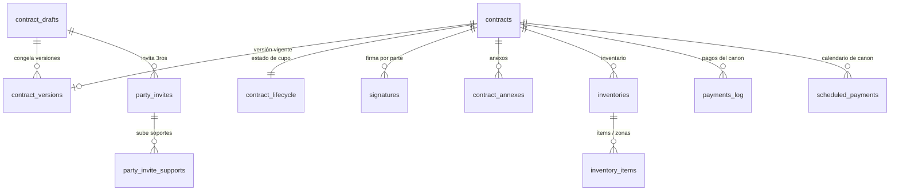
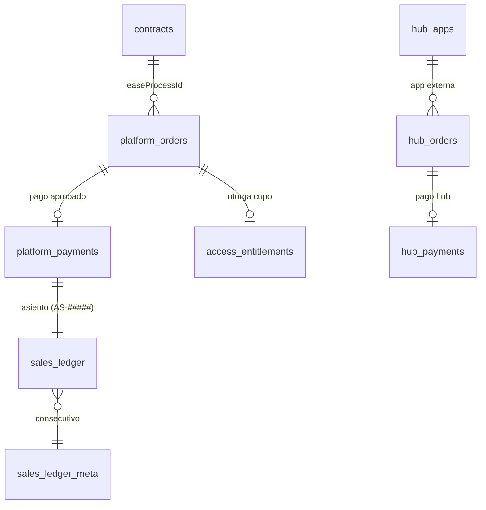
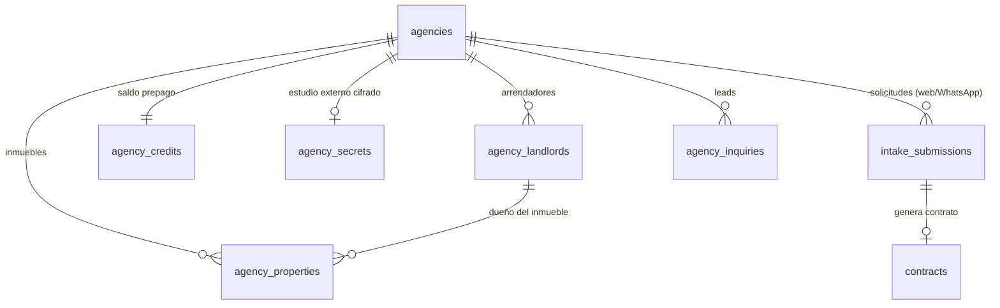
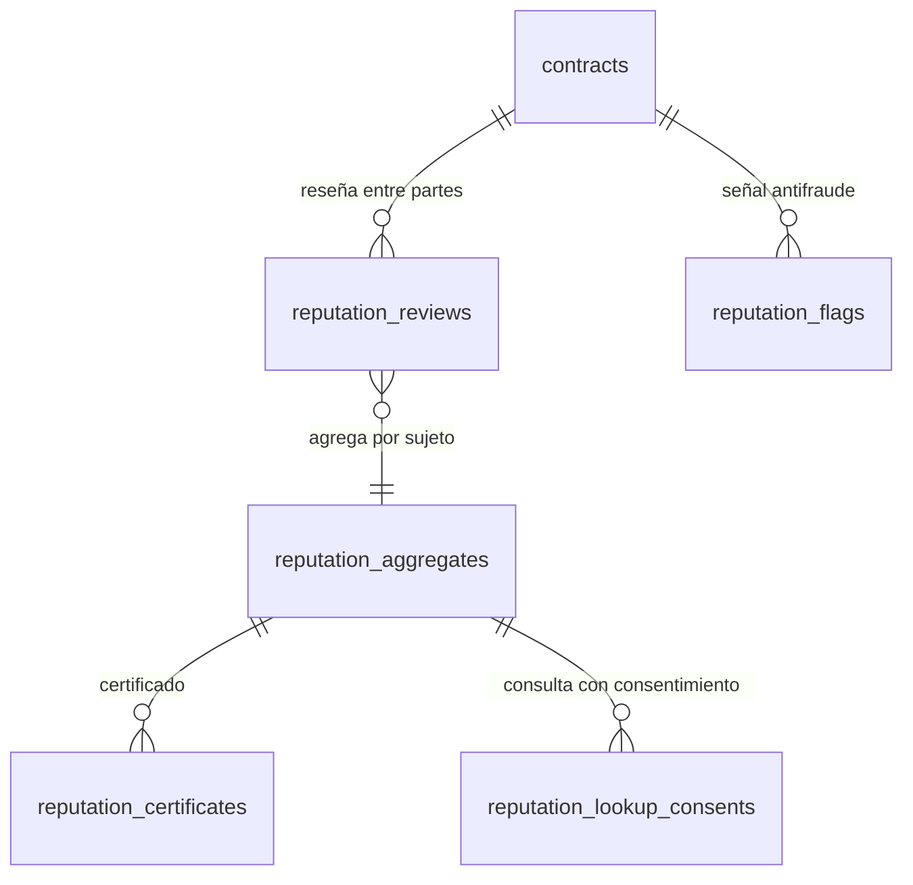

# Esquema de base de datos — ArriendoSeguro (Firestore)

> **Última actualización:** 2026-09-30 · Derivado del código (fuente de verdad), no de datos.

## Cómo leer este documento

ArriendoSeguro usa **Cloud Firestore** (NoSQL orientado a documentos). Firestore **no tiene un esquema rígido** como una base SQL: cada documento de una colección puede variar. Por eso la "forma" de los datos se define en el **código** — en las interfaces de dominio (`web/src/domain/**`) y en las escrituras (`.set/.add/.update`). Este documento reconstruye ese esquema a partir del código.

### Convenciones
- **Doc id:** salvo que se indique, es **autogenerado** (`.doc()`). Algunas colecciones usan un id **determinístico** (p. ej. `= contractId`, `= agencyId`, `= token`, `= uid`, `= "counter"`) para lecturas directas e idempotencia.
- **Fechas:** casi siempre como **string ISO** (`createdAt`, `updatedAt`); a veces con un gemelo `*Server` que es un `serverTimestamp()` real (para orden/consistencia).
- **Archivos:** las imágenes/PDF viven en **Firebase Storage**; en Firestore solo se guarda la **ruta/URL** (`storagePath`, `*Url`).
- **Relaciones:** no hay claves foráneas; se referencian por id en un campo (p. ej. `contractId`, `agencyId`). Los `uid` apuntan a **Firebase Auth**.

---

## Diagramas entidad–relación (por dominio)

### 1) Contrato, firma y expediente (núcleo)

### 2) Monetización (Plan Plus + hub de pagos)

### 3) Agencias (contratos en volumen)

### 4) Reputación (privada, con consentimiento)

---

## Catálogo de colecciones

### Contratos y firma

| Colección | Doc id | Propósito | Campos clave |
|---|---|---|---|
| `contracts` | = draftId (agencia: autogen) | Cabecera/estado del expediente | draftId, status(draft/signed/closed), currentVersionId, hasSolidaryCoDebtor, createdByUid/Email, agencyId?, terminationNotice? |
| `contract_versions` | autogen (inmutable) | Snapshot HTML+payload+hash de cada versión | contractId, contractDraftId, versionNumber, html, contractPayload(`ResidentialLeaseContractInput`), documentHash, generatedAt |
| `contract_drafts` | = contractDraftId (=leaseProcessId) | Borrador del wizard | payload del wizard (forma variable), specialClauses, lastUpdatedAt |
| `contract_lifecycle` | = contractId | Anti-abuso del cupo Plus | started, startedAt?, entitlementConsumed?, unlockedByAdminAt? |
| `contract_annexes` | = annexId | Anexos (inventario, acta, log de pagos, evidencia de firma, notarial, autorizaciones, evaluación) | contractId, contractVersionId, annexType, status, htmlContent, pdfUrl?, documentHash? |
| `signatures` | autogen | Firma electrónica por parte | contractId, partyType(landlord/tenant/solidaryCoDebtor_n), signerEmail, signatureStatus, signatureMethod, tokenHash, consentAccepted, signedAt?, evidenceJson? |
| `special_clause_reviews` | = token | Round-trip con abogado por cláusula «Otra» | contractDraftId, status(pending/drafted/declined), finalText |
| `notarial_shares` | = token | Enlace sin cuenta para firma con notaría (ANND) | contractId, role, inviteeName, status, lastUploadedAnnexId? |
| `draft_property_docs` | autogen | Docs de propiedad/poder en borrador | contractDraftId, docType, fileName, storagePath |
| `custom_alerts` | autogen | Recordatorios personalizados por contrato | contractId, ownerUid, name, message, frequency, nextFireAt |
| `contract_reminder_logs` | autogen | Bitácora de recordatorios de renovación | contractId |
| `utility_guarantee_acceptances` | autogen | Aceptación garantía servicios (Art. 15 Ley 820) | contractId, contractVersionId |
| `custody_orders` | = reference | Custodia documental (proveedor externo) | reference, contractId, estado |
| `oath_evidence` | autogen | Evidencia de juramentos/aceptaciones al firmar | contractDraftId |
| `document_manual_reviews` | autogen | Revisiones manuales antifraude | scope(=draftId) |

**Subcolecciones de `contracts/{contractId}`:** `property_documents` (docs confirmados), `novedades` (bitácora/solicitudes), `maintenance` (mantenimiento bidireccional), `tenant_supports` / `codebtor_supports` (soportes de ingresos).

### Inventario

| Colección | Doc id | Propósito | Campos clave |
|---|---|---|---|
| `inventories` | autogen | Cabecera de inventario (inicial/final) | contractId, contractVersionId, inventoryType, status, documentHash? |
| `inventory_items` | autogen | Ítems (modo bloque) | inventoryId, condición, photoUrls[] |
| `inventory_selected_zones` / `inventory_zone_details` / `inventory_zone_items` | autogen | Detalle por zonas (modo guiado) | inventoryId, selectedZoneId, photoUrls[] |
| `inventory_meter_readings` / `inventory_keys` | autogen | Medidores y llaves | inventoryId |

### Monetización

| Colección | Doc id | Propósito | Campos clave |
|---|---|---|---|
| `platform_orders` | autogen | Orden de compra Plan Plus (espejo del proveedor) | userId, leaseProcessId?, planCode, amount, currency, status, paymentProvider(mock/wompi/breb), providerReference, checkoutUrl |
| `platform_payments` | autogen | Pago aprobado (verdad del dinero) | orderId, provider, providerPaymentId, amount, status, approvedAt? |
| `access_entitlements` | autogen | Cupo/derecho (demo o Plus pagado) | userId, leaseProcessId?, planCode, accessType, status, maxContractsAllowed, contractsUsed |
| `sales_ledger` | = paymentId | Libro de ventas interno (AS-00001…) | internalCode, buyerEmail, amountCop, provider, orderId?, date |
| `sales_ledger_meta` | = "counter" | Contador atómico del consecutivo | last, updatedAt |
| `hub_orders` / `hub_payments` | autogen | Órdenes/pagos del hub para apps externas | referencias a `hub_apps` |
| `hub_apps` | autogen | Apps externas del hub (HMAC/API key hasheada) | name, apiKeyPrefix, apiKeyHash, hmacSecret, webhookUrl, active |
| `payment_upload_tokens` | = token | Subida de comprobante por enlace/QR sin sesión | token, status |

### Pagos de arriendo / posventa

| Colección | Doc id | Propósito | Campos clave |
|---|---|---|---|
| `payments_log` | autogen | Pago del canon reportado | contractId, periodLabel, dueDate, amountPaid, paymentStatus, supportFileUrl?, supportValidationStatus? |
| `payment_support_files` | autogen | Soportes de un pago | paymentLogId, fileUrl, uploadedByUserId |
| `scheduled_payments` | autogen | Calendario del canon + recordatorio/escalamiento | contractId, periodLabel, dueDate, expectedAmount, status, reminderStatus, tokens de escalamiento |
| `payment_reminder_settings` | = prs_${contractId} | Config de recordatorios | tenantEmail, defaultDaysBefore, landlordCopyEnabled |
| `contract_payment_settings` | = contractId | Política de comprobante/pago | — |
| `audit_logs` | autogen | Auditoría transversal | action, actor, refs (forma variable) |

### Agencias

| Colección | Doc id | Propósito | Campos clave |
|---|---|---|---|
| `agencies` | autogen | Agencia/inmobiliaria | name, memberEmails[], escalationEmail?, identityEnabled?, studyRules[]?, autoRecharge?, origin(admin/self_signup)?, trial?, ownerUid, status |
| `agency_landlords` | autogen | Arrendador reutilizable | agencyId, party(PersonParty) |
| `agency_properties` | autogen | Inmueble reutilizable | agencyId, landlordId?, address, city, commercialValue?, defaultRent? |
| `agency_credits` | = agencyId | Saldo prepago (1 crédito = 1 contrato) | balance, totalPurchased, totalConsumed |
| `agency_secrets` | = agencyId | Estudio externo (DataCrédito) — API key **cifrada** | endpoint?, scorePath?, keyEnc?(cifrado) |
| `agency_inquiries` | autogen | Leads hacia la agencia | agencyId |
| `agency_signup_locks` | = email | Lock anti-duplicado del auto-registro | email |
| `intake_submissions` | autogen (dedup) | Solicitud capturada (web/WhatsApp) | agencyId, tenant{}, study{}, identity{}, status, contractId?, source |

### Reputación

| Colección | Doc id | Propósito | Campos clave |
|---|---|---|---|
| `reputation_reviews` | = contractId__direction | Reseña entre partes | raterEmail, subjectEmail, direction, ratings, reply? |
| `reputation_aggregates` | = sha256(email) | Agregado privado por sujeto | totalReviews, overallAverage, byDirection |
| `reputation_flags` | autogen | Señales antifraude para admin | contractId, signals[], severity, status |
| `reputation_lookup_consents` | determinístico | Consentimiento Habeas Data para consultar | — |
| `reputation_directory_consents` | = key | Consentimiento de directorio | — |
| `reputation_certificates` | = token | Certificado compartible por enlace | subjectKey |

### Inquilino / invitaciones / entidades guardadas

| Colección | Doc id | Propósito | Campos clave |
|---|---|---|---|
| `party_invites` | = token | Invitación a inquilino/codeudor (OTP) | contractDraftId, role, inviteeEmail, status, otpHash? |
| `party_invite_supports` | autogen | Soportes que sube el invitado | contractDraftId, fileName, docKey? |
| `saved_party_profiles` | = role__email | Perfil reutilizable del tercero | SavedLandlordProfile |
| `user_landlord_profiles` | = uid | Datos del arrendador guardados | fullName, documentType, email, phone |
| `user_properties` | autogen (por uid) | Inmuebles guardados | label, property{} |

> **Terminación / no renovación** no usa colección propia: vive como mapa `terminationNotice` en `contracts`. **Paz y salvo** opera con tokens sobre `contracts`/`contract_versions`/`scheduled_payments`.

### Referidos / aliados / feedback

| Colección | Doc id | Propósito | Campos clave |
|---|---|---|---|
| `referral_codes` | = code | Código de invitación → dueño | ownerUid |
| `referrals` | = uid del referido | Estado/calificación de la referencia | referrerUid, status, qualified |
| `partners` | autogen | Aliados de terceros (directorio) | name, category(seguro/juridica/cobranza/…), contactEmails[], active |
| `partner_leads` | autogen | Lead a un aliado (doble confirmación) | partnerId, outcome, tokens |
| `product_ideas` | autogen | "Deja tu idea" | — |

### Usuarios / consentimientos / contacto

| Colección | Doc id | Propósito | Campos clave |
|---|---|---|---|
| `user_profiles` | = uid | Perfil de cuenta (mis-datos) | — |
| `user_consents` | autogen | Consentimiento de datos (Ley 1581) | uid, version, surface, consentHash, acceptedAt |
| `contact_messages` | autogen | Mensajes del formulario de contacto | — |
| `lead_forms` | autogen | Leads de marketing | forma variable |

### Observabilidad / analítica / configuración

| Colección | Doc id | Propósito | Campos clave |
|---|---|---|---|
| `email_logs` / `sms_logs` / `whatsapp_logs` | autogen | Bitácora de envíos por canal | to, status, templateCode |
| `whatsapp_autoreply` | = teléfono | Anti-spam de autorespuesta | — |
| `observability_runs` | autogen | Bitácora de crons/jobs | — |
| `error_events` | = fingerprint | Errores agrupados (Sentry propio) | kind, message(PII enmascarada), count, resolved |
| `user_reports` | autogen | Reportes de abuso/bug (UGC) | kind, reporter, status |
| `status_incidents` | autogen | Incidentes de estado (/estado) | título, estado |
| `analytics_events` | autogen | Eventos de analítica propios | name, payload, day |
| `analytics_pageviews` | = YYYY-MM-DD | Visitas sin cookies (1 doc/día) + subcol `visitors/{hash}` | views, visitors |
| `contract_surveys` | autogen | Encuesta post-contrato | respuestas |
| `app_settings` | por módulo | Config de la app (1 doc por área) | docs: referral_config, plan_plus_pricing, tax, legal, ads, free_tier, observability |
| `admin_config` | por área | Config admin | docs: internal_admins (lista de admins), marketing, pitch |

---

## Notas

- **Total:** ~67 colecciones de nivel superior + subcolecciones (`contracts/*`, `analytics_pageviews/*/visitors`).
- **Motor de contrato:** el corazón del dato es `contract_versions.contractPayload` (tipo `ResidentialLeaseContractInput` en `web/src/domain/contracts/types.ts`), que contiene arrendador, arrendatario, codeudor(es), inmueble, términos del canon, servicios y cláusulas.
- **Seguridad de datos:** PII enmascarada en errores; llaves de terceros **cifradas** (`agency_secrets.keyEnc`); credenciales del hub **hasheadas** (`hub_apps.apiKeyHash`); consentimientos versionados (`user_consents`).
- **Colecciones de forma variable** (sin interface fija, derivadas de escrituras): `audit_logs`, `lead_forms`, `contact_messages`, `product_ideas`, `contract_surveys`, `agency_inquiries`, `hub_orders/hub_payments`, `email_logs/sms_logs/whatsapp_logs`.
